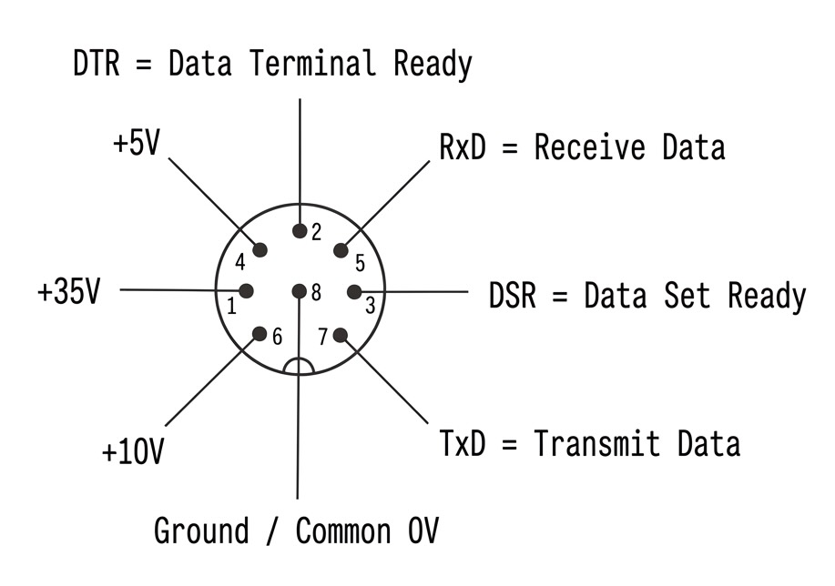

# Gabriele Embassy — RP2040 Typewriter Controller

Bare-metal Rust firmware for the **Raspberry Pi Pico W** (RP2040) that turns a Gabriele electronic typewriter into a WiFi-connected printer. Part of the [Gabriele Project](https://github.com/tarasstruk/gabriele).

## How It Works

The Pico W runs a TCP server on **port 1234**. When a client connects, the firmware:

1. Activates the typewriter by sending a start sequence over UART
2. Waits for the typewriter to acknowledge readiness
3. Prints a greeting ("Hallo Gabriele") and its own IP address on the typewriter
4. Accepts bytes from the TCP client, forwards each one to the typewriter via UART
5. Waits for the typewriter's confirmation pulse before accepting the next byte
6. Echoes each confirmed byte back to the TCP client (flow control)
7. On disconnect, sends a stop sequence to deactivate the typewriter (a new TCP connection will wake it again)

Each byte is flow-controlled one at a time — the firmware will not send the next byte until the typewriter physically confirms it has finished processing the previous one.

## Requirements

- **Hardware**: Raspberry Pi Pico W connected to a Gabriele typewriter via UART
- **Software**: Rust toolchain with the `thumbv6m-none-eabi` target, and [probe-rs](https://probe.rs/) for flashing
- **Sibling crate**: The [`gabriele`](https://github.com/tarasstruk/gabriele) library must be cloned at `../gabriele/gabriele` relative to this project

## Wiring



| Pico W Pin | Function                        |
|------------|---------------------------------|
| GP4        | UART1 TX (to typewriter)        |
| GP5        | UART1 RX (from typewriter)      |
| GP7        | RTS (flow control to typewriter) |
| GP3, GP4   | PIO1 inputs (confirmation pulse detection) |
| GP23, GP24, GP25, GP29 | CYW43 WiFi (on-board) |

UART runs at **4800 baud**.

## Setup

### 1. Clone the required sibling crate

```sh
# From the parent directory of this project:
git clone https://github.com/tarasstruk/gabriele ../gabriele
```

### 2. Configure WiFi credentials

Create two plaintext files in the project root (no trailing newline):

```sh
echo -n "YourNetworkName" > wifi_net
echo -n "YourPassword" > wifi_pass
```

These are embedded into the firmware at compile time.

### 3. Install the Rust target

```sh
rustup target add thumbv6m-none-eabi
```

### 4. Install probe-rs

```sh
cargo install probe-rs-tools
```

## Build & Flash

```sh
cargo build          # Cross-compile for RP2040
cargo run            # Build and flash via probe-rs debug probe
```

The firmware binary is compiled with the `defmt` logging framework. To see log output, use a probe-rs-compatible tool:

```sh
probe-rs run --chip RP2040 target/thumbv6m-none-eabi/debug/main
```

## Usage

Once flashed and powered on, the Pico W will:

1. Connect to the configured WiFi network (retries indefinitely)
2. Obtain a DHCP address
3. Listen for TCP connections on port 1234

### Sending commands to the typewriter

The TCP interface is a raw byte passthrough — the client must send the typewriter's native UART protocol bytes (as defined by the `gabriele` crate), not ASCII text. The firmware does not perform any character-to-instruction translation on the TCP stream; that translation is the client's responsibility.

Each byte sent by the client is forwarded to the typewriter over UART. The firmware waits for the typewriter's physical confirmation pulse, then echoes the byte back to the client. The client should wait for this echo before sending the next byte.

```sh
# Connect to the typewriter's raw byte interface
nc <pico-ip> 1234
```

> **Note**: The greeting message ("Hallo Gabriele" + IP address) printed on connection is the only place where high-level text-to-instruction translation happens, using `Machine::print()` from the `gabriele` crate internally.

The connection has a **120-second idle timeout**. If the typewriter doesn't confirm a byte within **2 seconds**, the connection is dropped.

### Session protocol

The firmware manages typewriter sessions automatically:

- **On connect**: Sends `0xA1 0x00 0xA2 0x00` (start) and waits for UART acknowledgment `0xA1 0xA2`
- **On disconnect**: Sends `0xA3 0x00 0xA0 0x00` (stop) and waits for acknowledgment `0xA3 0xA0`

If the typewriter doesn't acknowledge the start sequence, the connection is refused and the server returns to listening.

## Project Structure

```
├── src/
│   ├── main.rs           # Entry point, WiFi + TCP server loop
│   ├── tasks.rs          # Embassy async tasks (UART TX, PIO, WiFi, network)
│   ├── feedback.rs       # UART RX acknowledgment protocol
│   └── setup_pio_1.rs    # PIO1 state machine for pulse detection
├── cyw43-firmware/       # Vendored WiFi chip firmware (included at compile time)
├── memory.x              # RP2040 flash/RAM linker layout
├── build.rs              # Copies memory.x, sets linker flags
├── wifi_net              # WiFi SSID (not committed)
├── wifi_pass             # WiFi password (not committed)
└── Cargo.toml
```

## Troubleshooting

- **Build fails with missing `gabriele` crate** — Ensure `../gabriele/gabriele` exists relative to this project
- **Build fails with file not found** — Create `wifi_net` and `wifi_pass` files in the project root
- **No log output** — Logging uses `defmt` over RTT, which requires a debug probe connection. There is no serial/USB console output
- **Typewriter not responding** — Check UART wiring (GP4/GP5), baud rate is 4800, and RTS pin (GP7) connections
- **WiFi won't connect** — Verify credentials in `wifi_net`/`wifi_pass`; the firmware retries indefinitely with log output on each failure

## License

See the main [Gabriele Project](https://github.com/tarasstruk/gabriele) repository.
